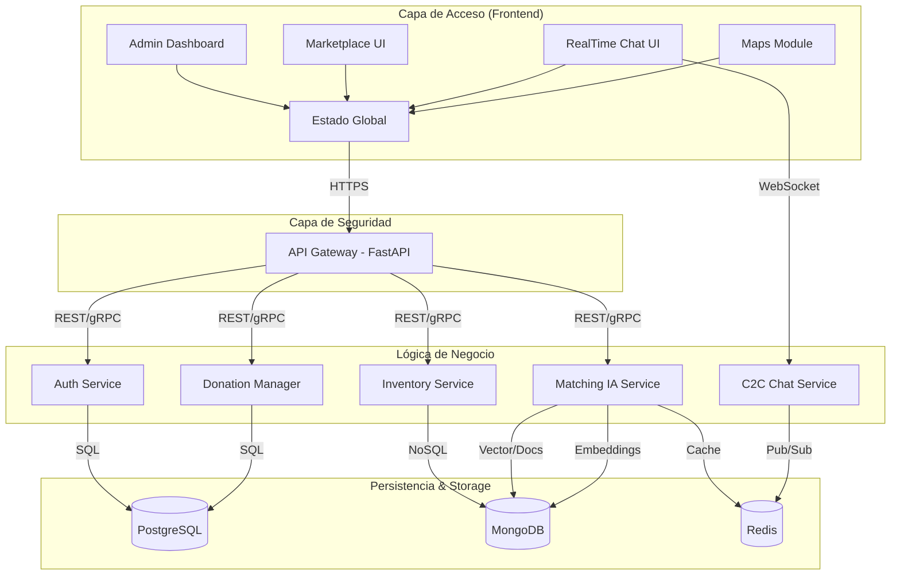

# Arquitectura del Sistema - Biblioteca Virtual

Este documento describe la infraestructura y el flujo de datos del proyecto Biblioteca Virtual, basado en el diagrama de arquitectura proporcionado.

## Diagrama de Arquitectura (Mermaid)

## 1. Capa de Acceso (Frontend - React.js)
La interfaz de usuario está construida con React.js y gestiona el estado global mediante Context API o Zustand.
- **Admin Dashboard**: Panel de analíticas para la gestión del sistema.
- **Marketplace UI**: Interfaz de catálogo y marketplace (Vite).
- **RealTime Chat UI**: Sistema de mensajería instantánea mediante WebSockets.
- **Maps Module**: Integración con Leaflet API para la geolocalización de puntos de entrega en Maipú.

## 2. Capa de Seguridad & Gateway (FastAPI)
Actúa como el punto de entrada único para todas las solicitudes del frontend.
- **API Gateway**: Gestiona la validación de tokens JWT, Rate Limiting y las políticas de CORS.

## 3. Capa de Lógica de Negocio (Microservicios Asíncronos)
Los servicios internos procesan la lógica mediante llamadas REST/gRPC.
- **Auth Service**: Gestión de registros, inicios de sesión y RBAC (Control de Acceso Basado en Roles).
- **Donation Manager**: Sistema de agendamiento de donaciones y gestión de reputación.
- **Inventory Service**: Operaciones CRUD para libros, gestión de stock y estados.
- **Matching IA Service**: Motor de IA que utiliza LangChain y OpenAI API para embeddings y búsquedas inteligentes.
- **C2C Chat Service**: Orquestador de mensajes para el intercambio entre vecinos.

## 4. Capa de Persistencia & Mensajería (Storage)
- **PostgreSQL**: Base de datos relacional para Usuarios, Roles, Donaciones y Transacciones (Cumplimiento ACID).
- **MongoDB**: Base de datos NoSQL para el Catálogo de Libros y Metadatos de IA (Flexibilidad documental).
- **Redis**: Capa de caché y Message Broker para la mensajería Pub/Sub en tiempo real.

---
*Nota: La infraestructura está aislada dentro de una red de Docker (Docker_Network).*
